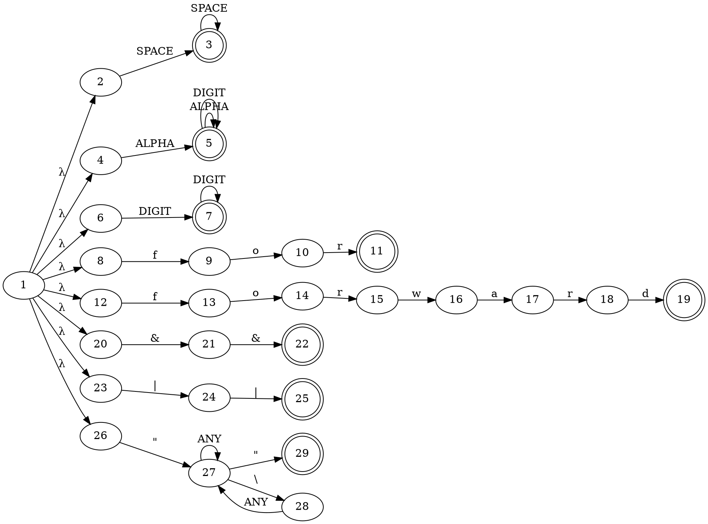
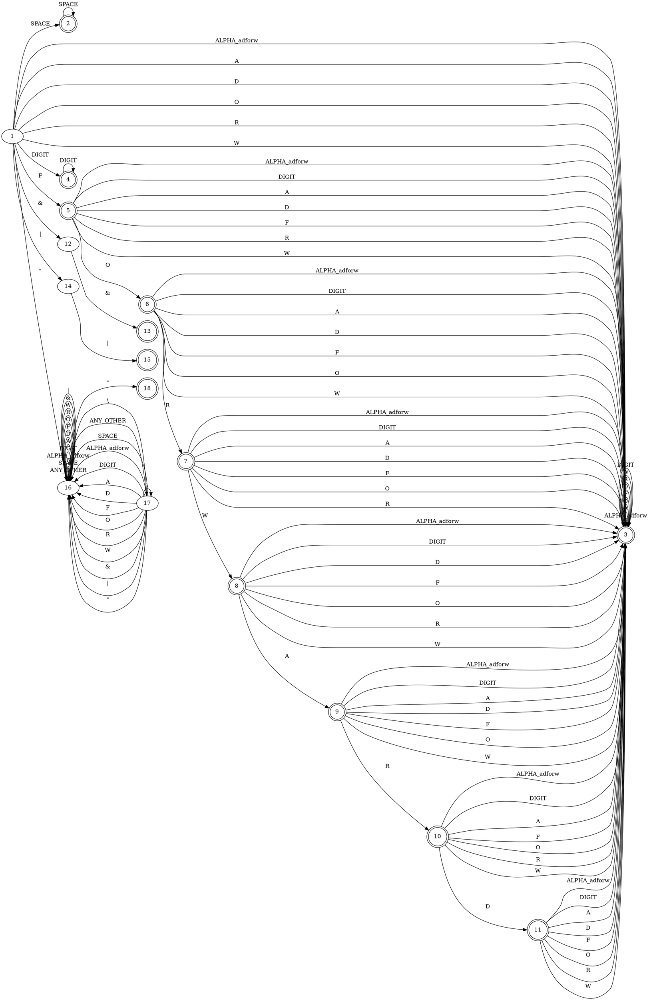

% Лабораторная работа № 1.4 «Лексический распознаватель»
% 6 марта 2024 г.
% Сергей Виленский, ИУ9-62Б

# Цель работы
Целью данной работы является изучение использования
детерминированных конечных автоматов с размеченными
заключительными состояниями (лексических
распознавателей) для решения задачи лексического анализа.

# Индивидуальный вариант
for, forward, &&, ||, строковые литералы ограничены
двойными кавычками, для включения кавычки в строковой
литерал она предваряется знаком «\» (но знак «\» без
последующей кавычки ошибкой не является), могут
пересекать границы строк текста.

# Реализация

Лексическая структура языка — регулярные выражения для доменов:

|Идентификатор  |Регулярное выражение|
|:-             |:-             |
|`SPACE`        |`(\s)+`        |
|`IDENT`        |`\w(\w\|\d)*`  |
|`DIGIT`        |`(\d)+`        |
|`_FOR_`        |`for`          |
|`_FORWARD_`    |`forward`      |
|`_&&_`         |`&&`           |
|`_\|\|_`       |`\|\|`         |
|`STRING`       |`"(.\|\")"`    |

Граф недетерминированного распознавателя:



Граф детерминированного распознавателя:



Реализация распознавателя:

```c++
#include <iostream>
#include <fstream>
#include <string>
#include <unordered_map>
#include <unordered_set>

#include "lib/ProgramaIterator.cpp"

enum class SymbolFactor {
    ANY_OTHER,
    SPACE,
    DIGIT,
    ALPHA_adforw,
    A,
    D,
    F,
    O,
    R,
    W,
    LOGIC_AND,
    LOGIC_OR,
    DOUBLE_QUOTES,
    BACKSLAH,
};

auto classificateSymbol(char symbol) -> SymbolFactor {
    if (isspace(symbol)) {
        return SymbolFactor::SPACE;
    }
    if (isdigit(symbol)) {
        return SymbolFactor::DIGIT;
    }
    if (isalpha(symbol)) {
        switch (symbol) {
        case 'a':
            return SymbolFactor::A;
        case 'd':
            return SymbolFactor::D;
        case 'f':
            return SymbolFactor::F;
        case 'o':
            return SymbolFactor::O;
        case 'r':
            return SymbolFactor::R;
        case 'w':
            return SymbolFactor::W;
        default:
            return SymbolFactor::ALPHA_adforw;
        }
    }
    switch (symbol) {
    case '&':
        return SymbolFactor::LOGIC_AND;
    case '|':
        return SymbolFactor::LOGIC_OR;
    case '"':
        return SymbolFactor::DOUBLE_QUOTES;
    case '\\':
        return SymbolFactor::BACKSLAH;
    default:
        return SymbolFactor::ANY_OTHER;
    }
}

using LexerDFA = std::unordered_map<
        std::size_t,        // начальная вершина ребра
        std::unordered_map<
            SymbolFactor,   // символ перехода из вершины
            std::size_t     // конечная вершина ребра
        >
    >;

const LexerDFA
INDIVIDUAL_LEXER = {
    {1, {
        {SymbolFactor::SPACE,           2},
        {SymbolFactor::ALPHA_adforw,    3},
        {SymbolFactor::DIGIT,           4},
        {SymbolFactor::A,               3},
        {SymbolFactor::D,               3},
        {SymbolFactor::F,               5},
        {SymbolFactor::O,               3},
        {SymbolFactor::R,               3},
        {SymbolFactor::W,               3},
        {SymbolFactor::LOGIC_AND,       12},
        {SymbolFactor::LOGIC_OR,        14},
        {SymbolFactor::DOUBLE_QUOTES,   16},
    }},
    {2, {
        {SymbolFactor::SPACE,           2},
    }},
    {3, {
        {SymbolFactor::ALPHA_adforw,    3},
        {SymbolFactor::A,               3},
        {SymbolFactor::D,               3},
        {SymbolFactor::F,               3},
        {SymbolFactor::O,               3},
        {SymbolFactor::R,               3},
        {SymbolFactor::W,               3},
        {SymbolFactor::DIGIT,           3},
    }},
    {4, {
        {SymbolFactor::DIGIT,           4},
    }},
    {5, {
        {SymbolFactor::ALPHA_adforw,    3},
        {SymbolFactor::DIGIT,           3},
        {SymbolFactor::A,               3},
        {SymbolFactor::D,               3},
        {SymbolFactor::F,               3},
        {SymbolFactor::O,               6},
        {SymbolFactor::R,               3},
        {SymbolFactor::W,               3},
    }},
    {6, {
        {SymbolFactor::ALPHA_adforw,    3},
        {SymbolFactor::DIGIT,           3},
        {SymbolFactor::A,               3},
        {SymbolFactor::D,               3},
        {SymbolFactor::F,               3},
        {SymbolFactor::O,               3},
        {SymbolFactor::R,               7},
        {SymbolFactor::W,               3},
    }},
    {7, {
        {SymbolFactor::ALPHA_adforw,    3},
        {SymbolFactor::DIGIT,           3},
        {SymbolFactor::A,               3},
        {SymbolFactor::D,               3},
        {SymbolFactor::F,               3},
        {SymbolFactor::O,               3},
        {SymbolFactor::R,               3},
        {SymbolFactor::W,               8},
    }},
    {8, {
        {SymbolFactor::ALPHA_adforw,    3},
        {SymbolFactor::DIGIT,           3},
        {SymbolFactor::A,               9},
        {SymbolFactor::D,               3},
        {SymbolFactor::F,               3},
        {SymbolFactor::O,               3},
        {SymbolFactor::R,               3},
        {SymbolFactor::W,               3},
    }},
    {9, {
        {SymbolFactor::ALPHA_adforw,    3},
        {SymbolFactor::DIGIT,           3},
        {SymbolFactor::A,               3},
        {SymbolFactor::D,               3},
        {SymbolFactor::F,               3},
        {SymbolFactor::O,               3},
        {SymbolFactor::R,               10},
        {SymbolFactor::W,               3},
    }},
    {10, {
        {SymbolFactor::ALPHA_adforw,    3},
        {SymbolFactor::DIGIT,           3},
        {SymbolFactor::A,               3},
        {SymbolFactor::D,               11},
        {SymbolFactor::F,               3},
        {SymbolFactor::O,               3},
        {SymbolFactor::R,               3},
        {SymbolFactor::W,               3},
    }},
    {11, {
        {SymbolFactor::ALPHA_adforw,    3},
        {SymbolFactor::DIGIT,           3},
        {SymbolFactor::A,               3},
        {SymbolFactor::D,               3},
        {SymbolFactor::F,               3},
        {SymbolFactor::O,               3},
        {SymbolFactor::R,               3},
        {SymbolFactor::W,               3},
    }},
    {12, {
        {SymbolFactor::LOGIC_AND,       13},
    }},
    {14, {
        {SymbolFactor::LOGIC_OR,        15},
    }},
    {16, {
        {SymbolFactor::ANY_OTHER,       16},
        {SymbolFactor::SPACE,           16},
        {SymbolFactor::DIGIT,           16},
        {SymbolFactor::ALPHA_adforw,    16},
        {SymbolFactor::A,               16},
        {SymbolFactor::D,               16},
        {SymbolFactor::F,               16},
        {SymbolFactor::O,               16},
        {SymbolFactor::R,               16},
        {SymbolFactor::W,               16},
        {SymbolFactor::LOGIC_AND,       16},
        {SymbolFactor::LOGIC_OR,        16},
        {SymbolFactor::DOUBLE_QUOTES,   18},
        {SymbolFactor::BACKSLAH,        17},
    }},
    {17, {
        {SymbolFactor::ANY_OTHER,       16},
        {SymbolFactor::SPACE,           16},
        {SymbolFactor::DIGIT,           16},
        {SymbolFactor::ALPHA_adforw,    16},
        {SymbolFactor::A,               16},
        {SymbolFactor::D,               16},
        {SymbolFactor::F,               16},
        {SymbolFactor::O,               16},
        {SymbolFactor::R,               16},
        {SymbolFactor::W,               16},
        {SymbolFactor::LOGIC_AND,       16},
        {SymbolFactor::LOGIC_OR,        16},
        {SymbolFactor::DOUBLE_QUOTES,   16},
        {SymbolFactor::BACKSLAH,        17},
    }},
};
const std::unordered_map<std::size_t, std::string>
FINAL_STATES = {
    {2, "SPACE"},
    {3, "IDENT"},
    {4, "DIGIT"},
    {5, "IDENT"},
    {6, "IDENT"},
    {7, "_FOR_"},
    {8, "IDENT"},
    {9, "IDENT"},
    {10, "IDENT"},
    {11, "_FORWARD_"},
    {13, "_&&_"},
    {15, "_||_"},
    {18, "STRING"},
};

int main() {
    std::ifstream fileStream{"prog.txt"};
    ProgramaIterator progIter{fileStream};

    // считываем из потока токены
    while (!progIter.eof()) {
        std::string finToken{};
        std::string finTokenType{};

        // сичтываем очередной токен
        std::string token{};
        std::size_t state = 1;
        while (true) {

            // случай распознания лексемы
            if ( FINAL_STATES.contains(state) ) {
                finToken = token;
                finTokenType = FINAL_STATES.at(state);
            }

            // случай захода в состояние ловушки
            SymbolFactor symFactor = classificateSymbol(progIter.cur());
            if ( !INDIVIDUAL_LEXER.contains(state) ||
                 !INDIVIDUAL_LEXER.at(state).contains(symFactor)
            ) {
                break;
            }

            // совершаем переход по классу символов
            state = INDIVIDUAL_LEXER.at(state).at(symFactor);


            // записываем следующий символ
            token += progIter.cur();

            // конец потока
            if ( progIter.eof() ) {
                break;
            }
            progIter.next();
        }

        // возвращаемся в начало считанного токена
        progIter.prev(token.size());

        // выводим результат считывания токена
        if (finToken.empty()) {
            std::cout
                << "ERROR "
                << progIter.pos()
                << '\n';
            progIter.next();
        } else {
            if (finTokenType != "SPACE") {
                std::cout
                    << finTokenType
                    << ' '
                    << progIter.pos()
                    << ": "
                    << finToken
                    << '\n';
            }
            progIter.next(finToken.size());
        }
        progIter.resetProgramaBuffer();
    }
    
    return 0;
}
```

# Тестирование

Входные данные

```
for forward&&hello
print
exford
forward123
123213
"321\\\\"32dwq 
    sdewq ывфыьывцйу"
3213ewwqe
&&
||
&|
|&
```

Вывод на `stdout`

```
_FOR_ (1, 1): for
_FORWARD_ (1, 5): forward
_&&_ (1, 12): &&
IDENT (1, 14): hello
IDENT (2, 1): print
IDENT (3, 1): exford
IDENT (4, 1): forward123
DIGIT (5, 1): 123213
STRING (6, 1): "321\\\\"32dwq
    sdewq ╤Л╨▓╤Д╤Л╤М╤Л╨▓╤Ж╨╣╤Г"
DIGIT (8, 1): 3213
IDENT (8, 5): ewwqe
_&&_ (9, 1): &&
_||_ (10, 1): ||
ERROR (11, 1)
ERROR (11, 2)
ERROR (12, 1)
ERROR (12, 2)
```

# Вывод
В результатом выполнения данной работы было
изучено использование детерминированных
конечных автоматов с размеченными заключительными
состояниями (лексических распознавателей) для
решения задачи лексического анализа.
